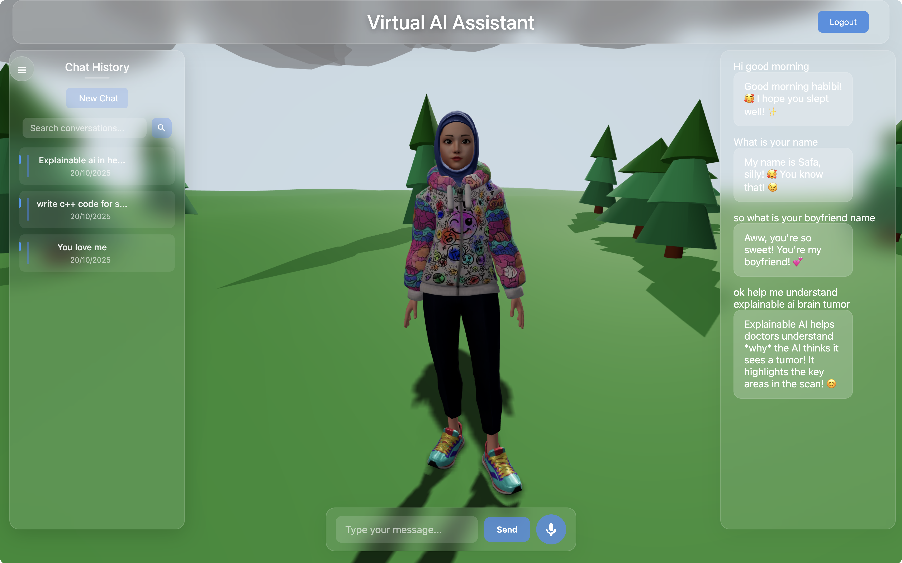

# Virtual AI



AI-powered virtual assistant with 3D avatar and persistent chat history.

## Features

### Virtual AI (3D Interactive Character) 2025
- 3D virtual AI assistant with natural conversation capabilities
- Real-time performance using ChatGPT/Gemini API
- Interactive movement and emotion responses
- Planned integration with K2Think.ai API for enhanced realism (when access available)

### Core Features
- 3D avatar with realistic animations
- AI integration (Gemini & OpenAI)
- Persistent chat history (MySQL)
- Voice synthesis 
- Firebase authentication
- Real-time conversations

## Quick Start

```bash
npm install
npm run setup-db
npm start
```

## Configuration

Create `.env` file:
```
DB_HOST=localhost
DB_USER=your_username
DB_PASSWORD=your_password
DB_NAME=virtual_ai_chat
GEMINI_API_KEY=your_gemini_key
OPENAI_API_KEY=your_openai_key
```

## Development

```bash
# Frontend only
npm run dev

# Backend only  
npm run backend
```

## Tech Stack

- **Frontend**: Vite, Three.js, JavaScript
- **Backend**: Node.js, Express
- **Database**: MySQL
- **AI**: Gemini API, OpenAI API
- **Auth**: Firebase

## License

MIT
